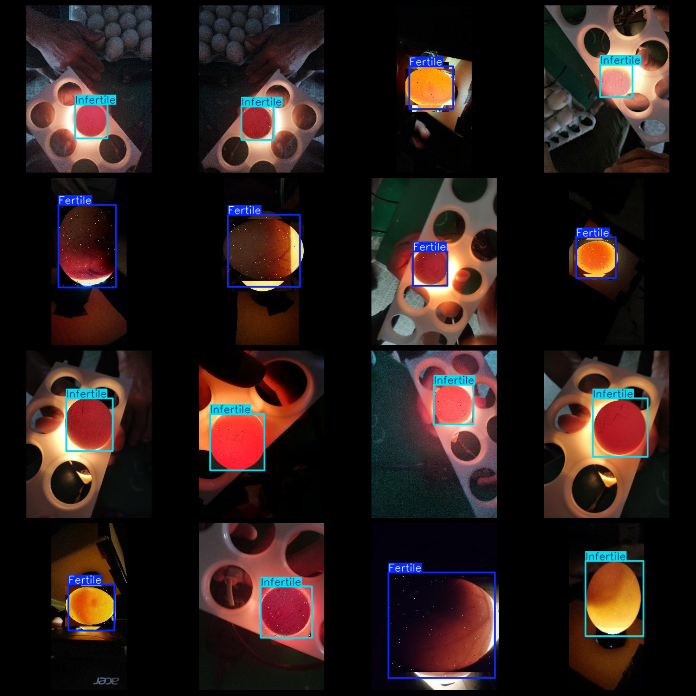
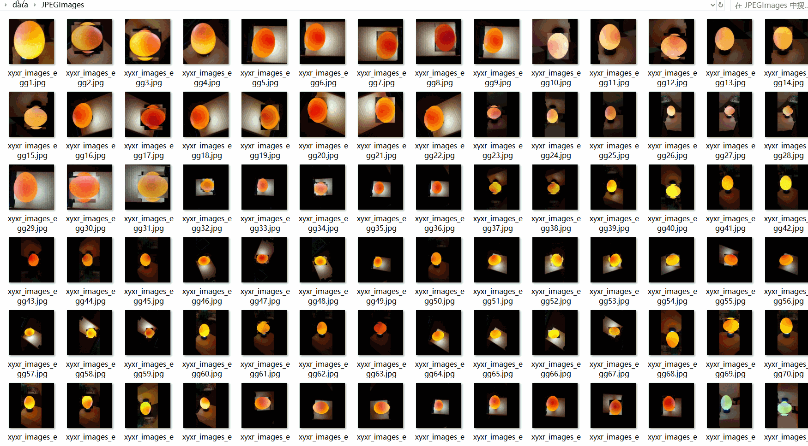

# Egg Fertilization Detection Dataset 4401 imagesVOC+YOLO format

Egg fertilization test dataset 4401 VOC + YOLO format

Dataset format: Pascal VOC format + YOLO format (the txt file does not contain the split path, it only contains jpg images and corresponding VOC format xml files and yolo format txt files)

Image Count: 4401

Number of xml files: 4,401

Number of txt files: 4401

Label count: 2

The Github repository is: datasets_sl

Annotation class names: ["Fertile","Infertile"]

Number of boxes labeled in each category:

Fertile Frame Count = 2534

The English translation is: "The number of infertile cases is 1867."

Total frame count: 4401

Number of images per category:

Fertile occupies 2534 images.

Infertile annotated images = 1867

Image resolution: 320x320

Use the labeling tool: labelImg

Dataset Augmentation: Yes

Rules for annotation: Draw a rectangle around the category.

Important note: The dataset does not have been divided into training, validation, and testing sets.

Special Disclaimer: This dataset does not guarantee the accuracy of the trained models or weight files.

Annotation and image details are as follows:

## Images

---

Here is a pay link on Stripe (https://buy.stripe.com/3cs8yP7sY87d0vu9AB). Please contact me lonlonago@foxmail.com after funding $89, and I will send you a complete data files, thank you!

